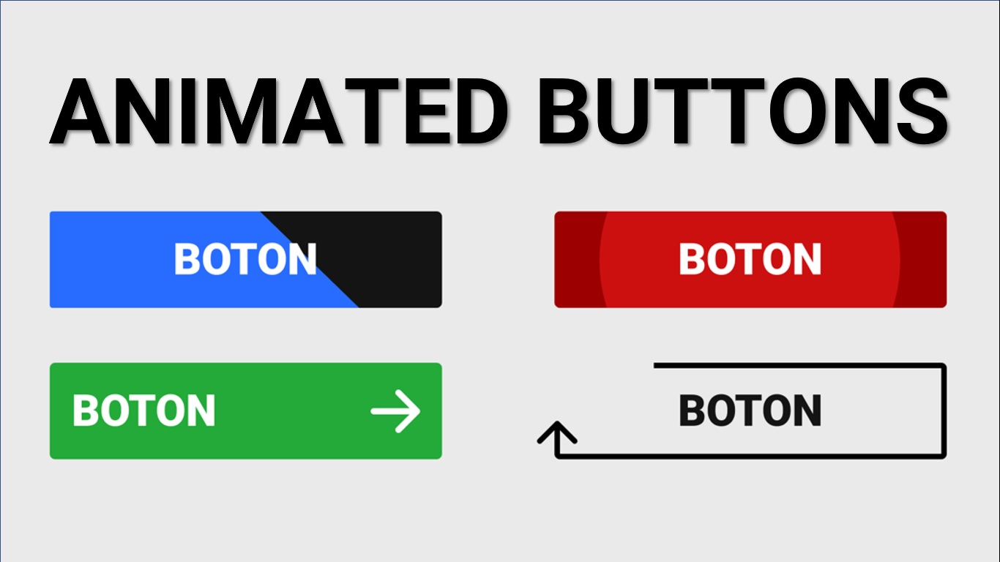

# Animated button with CSS

## Table of contents

  - [The challenge](#the-challenge)
  - [Links](#links)
  - [Built with](#built-with)
  - [Continued development](#continued-development)
  - [Useful resources](#useful-resources)

## Overview

### The challenge

Users should be able to:

- Make six differents animation buttons with CSS

### Screenshot

### Links
- [Live demo](https://jeraldinnemg.github.io/animated-buttons/)

## My process

### Built with

- Semantic HTML5 markup
- CSS custom properties

### Continued development

This kind of knowledge make the difference to design and create more originals projects, using different buttons instead of traditional and boring one.

PD: Feel free to make suggestions!

### Useful resources

- By FalconMaster[Tutorial: https://youtu.be/c-4wFMGFuCg](https://youtu.be/c-4wFMGFuCg)
- New properties learned:
 [stroke-width](https://developer.mozilla.org/en-US/docs/Web/SVG/Attribute/stroke-width) 
 [stroke-dasharray](https://css-tricks.com/almanac/properties/s/stroke-dasharray/) 
 [stroke-dasharray](https://css-tricks.com/almanac/properties/s/stroke-dashoffset/) 

